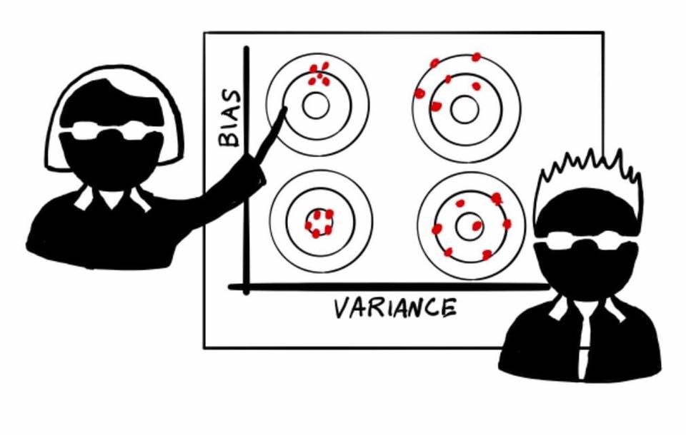

```{r setup, include=FALSE}
knitr::opts_chunk$set(echo = FALSE)
```


## Uncertainties to include

- Structure of SOC decay model
- Parameterization of SOC decay model
- Initialization
- Climate scaling
- Input estimation


## The Bayesian model (to repeat for each SOC decomposition structure)

```{tikz, echo=FALSE, fig.cap = "Orange = data, pink = multiple choiches, teal = standard node", fig.ext = 'png'}
\usetikzlibrary{shapes,decorations,arrows,calc,arrows.meta,fit,positioning}
\tikzset{
    -Latex,auto,node distance =1 cm and 1 cm,semithick,
    state/.style ={ellipse, draw, minimum width = 0.7 cm,fill=teal!60},
    stateforce/.style ={ellipse, draw, minimum width = 0.7 cm,fill=pink!60},
    statedata/.style ={ellipse, draw, minimum width = 0.7 cm,fill=orange!60},
    statemin/.style ={ellipse, draw, minimum width = 0 cm},
    point/.style = {circle, draw, inner sep=0.04cm,fill,node contents={}},
    bidirected/.style={Latex-Latex,dashed},
    el/.style = {inner sep=2pt, align=left, sloped}
}
\begin{tikzpicture}
    \node[state] (1) {$\Theta_n$};
    \node[statedata] (2) [right =of 1, xshift=9cm] {$C(t)$};

    \node[state] (b) [left  =of 1, xshift=-2cm] {$\beta_k$};
 
   \node[statedata] (c) [above =of b, xshift=0cm] {$v_1, v_{...}, v_k$};
   

    \node[statedata] (2x) [below =of 2, xshift=0cm] {$C(t_0)$};
    \node[statedata] (2xx) [below =of 2x, xshift=-2cm] {$\bar{I}$};

    \node[stateforce] (31) [above =of 1, xshift=2cm,yshift=2cm] {$\tau_1$};
    \node[stateforce] (32) [above =of 1, xshift=3cm,yshift=2cm] {$\tau_2$};
    \node[stateforce] (33) [above =of 1, xshift=4cm,yshift=2cm] {$\tau_3$};
    \node[state] (3x) [above =of 1, xshift=2cm,yshift=1cm] {$\tau$};

    \node[statedata] (3k) [above =of 32, xshift=0cm] {$T$};


    \node[stateforce] (41) [above =of 1,  xshift=-2cm,yshift=2cm] {$\psi_1$};
    \node[stateforce] (42) [above =of 1,  xshift=-3cm,yshift=2cm] {$\psi_2$};
    \node[stateforce] (43) [above =of 1,  xshift=-4cm,yshift=2cm] {$\psi_3$};
    \node[state] (4x) [above =of 1, xshift=-2cm,yshift=1cm] {$\psi$};

    \node[statedata] (4k) [above =of 42, xshift=0cm] {$M$};


    \node[stateforce] (51) [below =of 1, xshift=-2cm, yshift=-2cm] {$I_1$};
    \node[stateforce] (52) [below =of 1, xshift=-3cm, yshift=-2cm] {$I_2$};
    \node[state] (5x) [below =of 1, xshift=-2cm,yshift=-1cm] {$I$};

    \node[stateforce] (53) [below =of 1,  xshift=2cm, yshift=-2cm] {$E_1$};
    \node[stateforce] (54) [below =of 1,  xshift=3cm, yshift=-2cm] {$E_2$};
    %\node[stateforce] (55) [below =of 1,  xshift=4cm, yshift=-2cm] {$E_3$};
    \node[state] (55x) [below =of 1, xshift=2cm,yshift=-1cm] {$E$};

    \node[statedata] (5k) [below =of 1, yshift=-3.5cm] {$B$};


    \node[state] (6x) [below =of 1, xshift=5cm,yshift=-1cm] {$\Pi$};

    \path (1) edge node[above] {$p(\Theta  \mid \sum_{1}^{i} p(\tau_i) = 1, \sum_{1}^{i} p(\psi_i) = 1, \sum_{1}^{i} p(I_i) =1, \sum_{1}^{i} p(E_i)) =1 $} (2);
    \path [dashed] (1) edge node[el, above] {(steady state model version)} (2x);
    \path [dashed] (b) edge node[el, above] {(additional forcing)} (1);

    \path (31) edge node[el,above] {} (3x);
    \path (32) edge node[el,above] {} (3x);
    \path (33) edge node[el,above] {} (3x);
    \path (3x) edge node[el,below, rotate=180] {$\sum_{1}^{i} p(\tau_i) = 1$} (1);
    \path (3k) edge node[el,above] {} (31);
    \path (3k) edge node[el,above] {} (32);
    \path (3k) edge node[el,above] {} (33);


    \path (41) edge node[el,above] {} (4x);
    \path (42) edge node[el,above] {} (4x);
    \path (43) edge node[el,above] {} (4x);
    \path (4x) edge node[el,below] {$\sum_{1}^{i} p(\psi_i) = 1$} (1);
    \path (4k) edge node[el,above] {} (41);
    \path (4k) edge node[el,above] {} (42);
    \path (4k) edge node[el,above] {} (43);

    \path (51) edge node[el,above] {} (5x);
    \path (52) edge node[el,above] {} (5x);
    \path (5x) edge node[el,below] {$\sum_{1}^{i} p(I_i) = 1$} (1);

    \path (6x) edge node[el,above] {} (2x);
    \path (2xx) edge node[el,above] {} (2x);

    \path (53) edge node[el,above] {} (55x);
    \path (54) edge node[el,above] {} (55x);
    %\path (55) edge node[el,above] {} (55x);
    \path (55x) edge node[el,below, rotate=180] {$\sum_{1}^{i} p(e_i) = 1$} (1);
    \path (5k) edge node[el,above] {} (51);
    \path (5k) edge node[el,above] {} (52);
    \path (5k) edge node[el,above] {} (53);
    \path (5k) edge node[el,above] {} (54);
    %\path (5k) edge node[el,above] {} (55);

    \path (c) edge node[el,above] {} (b);


\end{tikzpicture}
```


## Considering the model structural uncertainty

The model structural uncertainty is left outside the Bayesian calibration in order to treat it more in detail.  
More specifically, I want to optimize the final ensemble for robustness with model selection.  
  
Optmizing for fitness alone does not cut it, **because overfitting.**


## The bias/variance trade off

Even with parametric models, the training data is never fully representative. A model too compliant with the data will have good fit, but can carry over **bias**. The worst for robust extrapolation in a distant future.

## Model complexity definitions
My aim is minimizing ensemble bias, still retaining a decent fitness.  
A less complex model tend to have less bias (and less fitness), and I define complexity around this aim  

## Graph/parameters based definitions
Number of parameters, or better number of connections in a DAG.

## Entropy based definitions
```{r image_grobs, fig.show = "hold", out.width = "40%", fig.align = "default"}


```

## Entropy based definitions: residuals
**Residuals:**  
In the literature it is commonly said that entropy in the residuals means less bias, since it means that the information left in the error is less organized, and more probably random. **More entropy = better** 
  
**Entropy and equifinality?**  
Will models with high equifinality, more complex, have higher entropy of their posteriors? More interactions means multimodal distributions, so there seems to me to be a mid-frequency spectrum where **more entropy = worse**


## Possible entropy definition: Shannon H 
We can consider the MCMC a discrete distribution and apply Shannon H calculation to it
\begin{equation}\label{eq:Shannon}
H = \sum_{i=1}^{n} - p(x_i) \cdot log_2 p(x_i)
\end{equation}  
Where $x$ is our likelihood and $i$ is each realization of the MCMC


## Other possible entropy definitions?
Is anyone confident with signal processing? Like Fourier and so on?
If we could analyze the distributions in the frequency spectrum, something interesting might appear, maybe?

