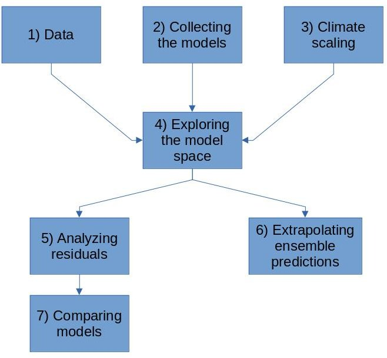

```{r setup, include=FALSE}
knitr::opts_chunk$set(echo = TRUE)
```

# The general idea
We want to:  
1. Produce aggregated national predictions on the C sequestration potential of Swedish agricultural soils with included model structural uncertainty  
2.  Understand the impact of various factors on prediction robustness 
To achieve these two goal, we will combine a selection of compartmental first-order SOC models, calibrate the whole ensemble on a set of Swedish long-term experiments, and then analyze the results of the ensemble in respect to various factors (for example climate, location, edaphic conditions).  
  
We will the utilize the ensemble for predictions, aggregated on a regional scale, about the total C sequestration potential in Swedish agricultural soils. These predictions will include a detailed uncertainty evaluation including also the model structural uncertainty.  


# Specific tasks

## 1 Data consolidation

## 2 The model ensemble
Most models we will utilize are already implemented in the SoilR package.  
One model in the set, the evolution of ICBM to include also edaphic para    meters (Jarvis, Meurer), needs to be programmed. 

### 2.1 Programming the edaphic decomposition model
The model will be programmed by using the same approach of the SoilR implementation, wrapping the ODE system defining the model with a numerical solver (deSolve).


## 3 The climate scaling ensemble
Compartmental models in general use a scaling factor, combination of soil moisture and temperature effects, to scale the decomposition kinetics of each pool.  
There are many different functions to express the impact of temperature and moisture on SOC decomposition, which can differ in their predictions. We can build an ensemble of climate scaling functions, to be then run withn a specific function which would give as output a range that we can then use as input for task 4.  
A criteria that must be satisfied by all moisture reduction functions is that they represent both the initial increase of microbial activity from dry to optimal conditions and the decrease from optima conditions to lack of oxygen due to water saturation.

### 3.1 The climate scaling of the edaphic decomposition model
This model is slightly different from the others since it implies a more explicit representation of the soil edaphic effects.


## 4 Exploring the model space
The model space exploration will be executed within the GLUE framework for the flexibility that it allows. In short, this implies running every model of the ensemble with a very long sequence of parameter sets, generated randomly within specified boundary values derived from literature or any other previous information.  
Each parameter set produces a series of model predictions, that can be compared with the values measured in each treatment  of each experiment. By applying a threshold, for example selecting only the parameter sets above a certain RMSE threshold, we have now a series of model parameterization each with its own performance indicator.  

## 4.1 Standardizing model initialization
We need to use a numerical steady state solver. Can this be done in SoilR?

## 4.2 Standardizing the input estimation
Intercept and slope as parameters

## 5 analyzing model residuals
The flexibility of GLUE is in the choice of the criteria. We could, for example, select all model runs above a certain **overall** RMSE threshold (using then the resulting ensemble for predictions), but also setting up a threshold specific for each site/treatment. We could then measure the density of the behavioral solutions for each model and each site/treatment, obtaining an indicator of the suitability of different models in different conditions.  
The method allows for other possibilities which needs to be discussed for the completion nof this tassk.

## 6 Comparing models
For model comparison we need to account for model complexity (due to the fact that a more complex model will in general have a better fit just because of the additional degrees of freedom). For doing that we will utilize a performance indicator normalized by parater numbers.  
A suitable indicator is the Akaike information coefficient (AIC). This could be already introduced in task nr 5, or utilized specifically only in task nr 6.

## 7 Extrapolating national predictions from the ensemble
This task is conceptually quite simple, since it involves just running the ensemble of behavioral models/parameter sets from task nr 4 with input and climatic data from the 19 Swedish regions. Predictions and their probability distributions will be based on the ensemble.

